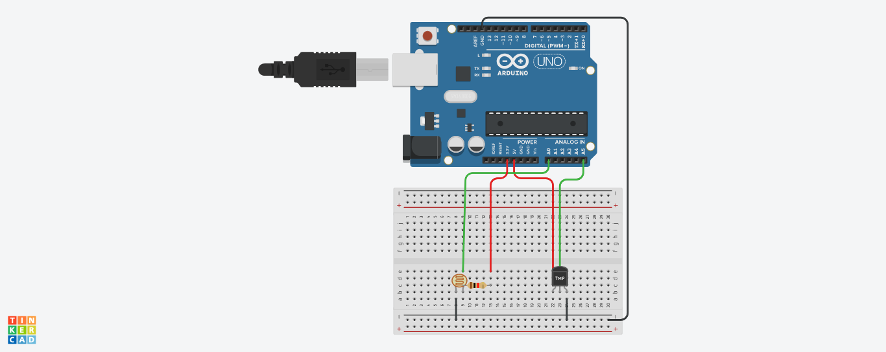
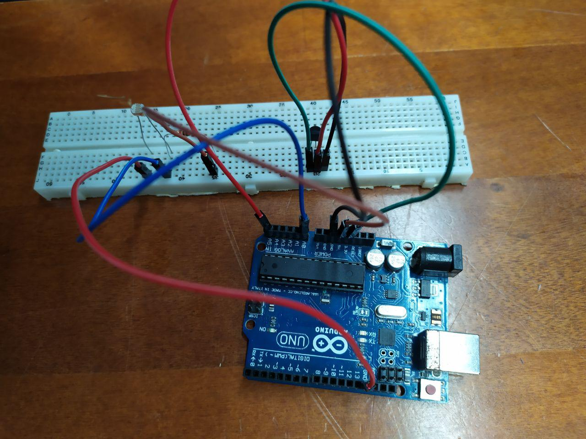
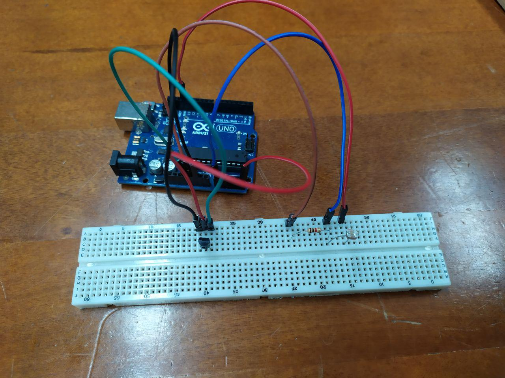
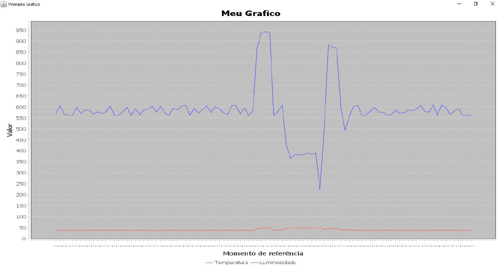

# Gerando Gráficos com Javino

## Como rodar o projeto

### Instalações

Primeiramente, clone o repositório. Depois, siga os passos abaixo:

*Instalando o Java*
1. Baixe o Java a partir de https://www.java.com/pt_BR/download/
2. Siga as instruções de instalação para o seu sistema operacional

*Instalando o jfreechart*

1. Baixar os arquivos .jar (v1.5.0) a partir do site http://repo1.maven.org/maven2/org/jfree/jfreechart/1.5.0/

*Instalando o Javino*

1. Baixar o Javino a partir do site http://javino.sf.net/
2. Baixar o Python 2.7 e o pip, ambos podem ser encontrados em https://www.python.org/
3. Depois do Python e do pip instalado, instale a biblioteca pyserial:
`pip install pyserial`

Depois de baixar o Javino e o jfreechart:
1. Abrir o projeto java, que está dentro da pasta [java](https://github.com/crismotinha/javino-with-charts/tree/master/java) que você baixou ao clonar o projeto.
2. Importar os .jar do jfreechart e do Javino no NetBeans indo em Bibliotecas > Adicionar JAR

*Instalando o Arduino IDE*

1. Baixar o Arduino IDE a partir do site https://www.arduino.cc/en/Main/Software#download 
2. Instalar de acordo com o seu sistema operacional, seguindo o passo-a-passo do site acima

### Montando a placa

Montar a placa da forma abaixo:

Independente da protoboard e da cor dos fios, o que é importante:
1. Ligar os grounds certos
2. Usar o resistor no sensor de luminosidade
3. Ligar o leitor de luminosidade (a mesma fileira que pega um dos fios do leitor com um dos do resistor) no analog A0
4. Ligar o leitor de temperatura no analog A5

A placa que usamos estava montada da seguinte forma:

### Rodando

1. Abra o Arduino IDE
2. Abra o projeto que está dentro da pasta [arduino](https://github.com/crismotinha/javino-with-charts/tree/master/arduino/javino_trabalho)
3. Compile para verificar se não existem erros (no botão :heavy_check_mark:)
4. Rode o projeto (no botão :arrow_right:)
5. Abra o projeto java no NetBeans, o mesmo que abrimos anteriormente e instalamos o jfreechart e o Javino
6. Compile e rode o projeto :)

### Resultados

O programa está configurado para pegar 100 pontos em sequência. Abaixo temos um gráfico gerado usando o programa. A linha vermelha indica a temperatura, e a azul a luminosidade. É possível observar os momentos que tampamos o sensor de luminosidade, e os momentos que apontamos uma lanterna para ele :))

Projeto feito com muito amor e carinho por @crismotinha, @leticiavna e @yuletrannin :hearts:
